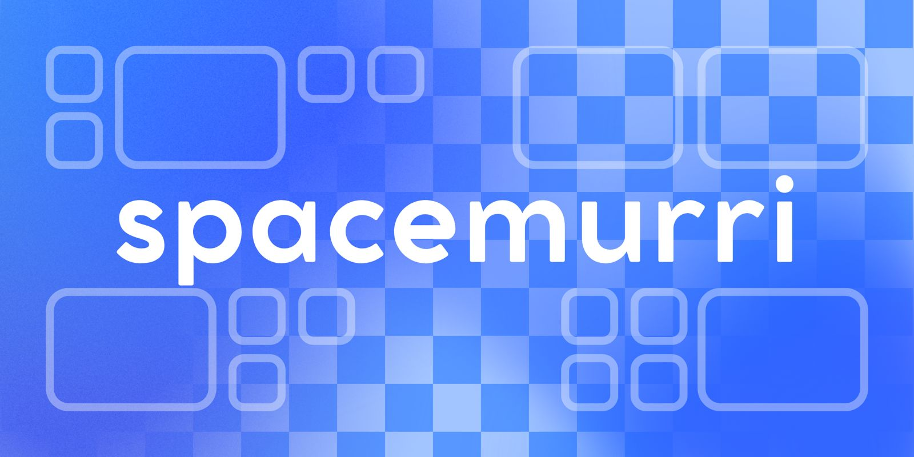
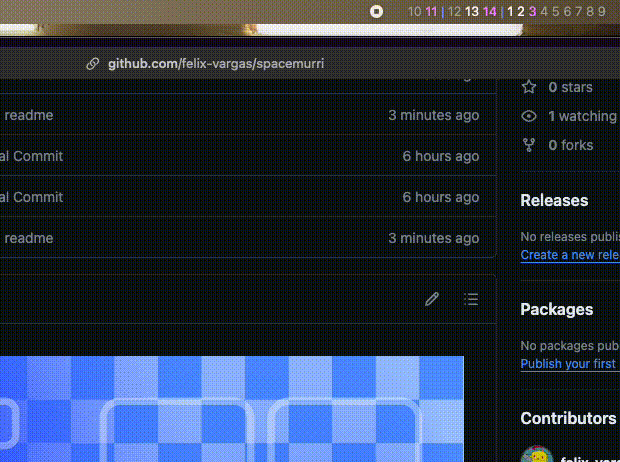

# About

*spacemurri* serves the purpose of showing you on the integrated macOs menu bar all your spaces separating them by display ( if you use multiple monitors ), if they have open apps in them and also which space you have in focus at the moment.

All this using in the background *yabai* as the main and only source of the status of each display and space.

# Requirements

| Requirement | Description                                  | Status  |
|-------------|----------------------------------------------|---------|
| [yabai](https://github.com/koekeishiya/yabai)    | Allows you to use *spacemurri* | Necessary |
| [skhd](https://github.com/koekeishiya/skhd)       | Is not necessary to use *spacemurri* but it will add a bunch of useful keybindings for you TWM   | Optional    |


# Installation and Configuration

First of all this project cannot work without *yabai* installed so for that i would highly recommend to follow the official documentation of *yabai* or the *yabai* setup guide by Josean Martinez

- https://github.com/koekeishiya/yabai
- https://www.josean.com/posts/yabai-setup

For the moment being the project is a WIP to get it built under an official Apple developer license so for now it's only usable by building it locally in your own mac.

1. ``` clone the repo ```
2. ``` Open as a project in XCode ```
3. ```Build```


# Screenshots



# WIP

- NS = Not Started
- WIP = Work In Progress

| Feature | Description                                  | Status  |
|-------------|----------------------------------------------|---------|
| Pre compiled   | Final step to release as an official app | NS |
| Config menu | Menu to display different options and configurations for customize your space watcher bar | WIP |
| Config option for display order | Feature to allow the user to choose in which order are the spaces ( multiple displays don't follow the ID order of how they are setted phisically)   | WIP    |
| Config for choosing colors | Feature that allows you to choose how each state of the space is represented in colors | NS |
| Config for changing separator icon | Choose which char is used to represent the separator for different displays | NS |